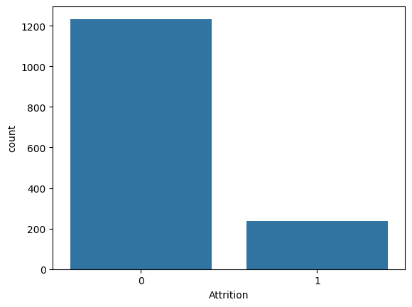
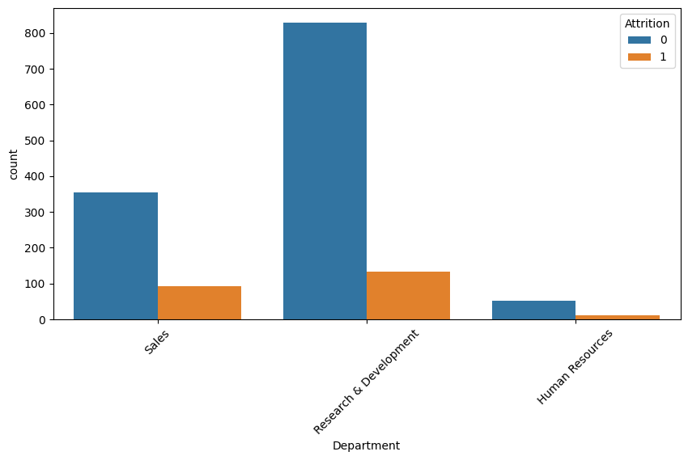
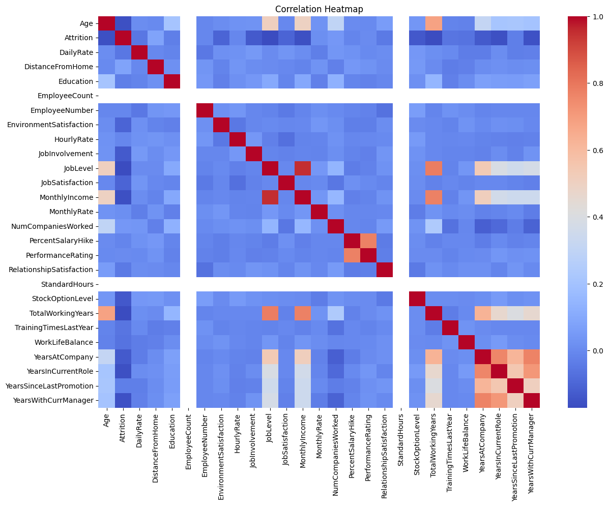
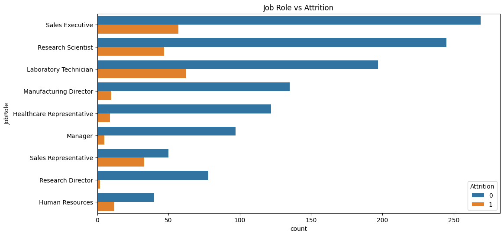
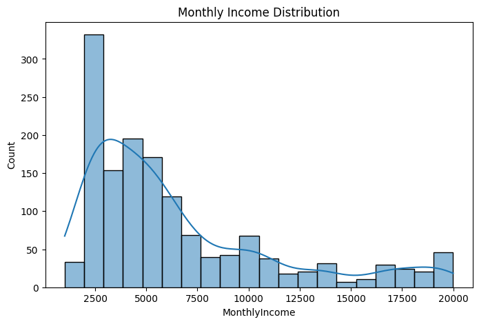
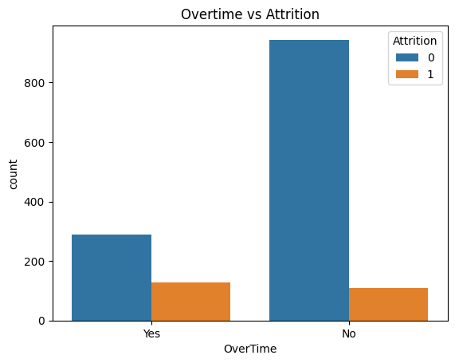

# Employee Attrition Analysis

## Project Overview

This project analyzes employee attrition using the IBM HR Analytics Employee Attrition dataset. The objective is to identify patterns and factors influencing employee turnover through data wrangling, exploratory data analysis (EDA), and visualization.

Employee attrition is a significant challenge for organizations as high turnover can increase recruitment costs, reduce productivity, and impact overall business performance. This project aims to uncover key factors associated with employee attrition and generate actionable business insights.

---

## Dataset Description

### Dataset Source

IBM HR Analytics Employee Attrition Dataset

### Dataset Information

* Records: 1470
* Features: 35

### Key Features

* Age
* Attrition
* Department
* JobRole
* MonthlyIncome
* OverTime
* YearsAtCompany
* JobSatisfaction
* EducationField
* MaritalStatus

### Target Variable

**Attrition**

* Yes = Employee Left
* No = Employee Stayed

---

## Data Wrangling

The following data wrangling tasks were performed:

### Data Loading

* Imported the dataset using Pandas.
* Examined dataset structure and dimensions.

### Data Inspection

* Checked column names and data types.
* Generated descriptive statistics.

### Missing Value Analysis

* Identified and analyzed missing values.

### Duplicate Handling

* Checked for duplicate records.
* Removed duplicates where necessary.

### Data Transformation

* Converted categorical variables into suitable formats.
* Encoded the Attrition column for analysis.

### Feature Engineering

* Created additional derived features.
* Prepared data for future machine learning applications.

---

## Exploratory Data Analysis (EDA)

Several visualizations were created to understand employee attrition patterns.

### Attrition Distribution

Analyzed the proportion of employees who stayed versus those who left.

### Department-wise Attrition

Compared attrition rates across departments.

### Overtime Analysis

Investigated the relationship between overtime work and employee turnover.

### Monthly Income Distribution

Analyzed employee salary distribution and its potential relationship with attrition.

### Job Role Analysis

Examined attrition patterns across different job roles.

### Correlation Analysis

Generated a heatmap to identify relationships among numerical variables.

---

## Sample Visualizations

### Attrition Distribution

### Department-wise Attrition

### Correlation Heatmap

### Job Role Analysis

### Monthly Income Distribution

### Overtime vs Attrition

---

## Key Insights

* Employees working overtime tend to have higher attrition rates.
* The Sales department experiences higher employee turnover compared to other departments.
* Employees with lower monthly income are more likely to leave the company.
* Younger employees show relatively higher attrition rates.
* Employees with longer tenure generally have lower attrition rates.

---

## Tools Used

* Python
* Google Colab
* Pandas
* NumPy
* Matplotlib
* Seaborn
* GitHub

---

## Project Structure

Employee-Attrition-Analysis/

├── cleaned_data/
│   └── cleaned_employee_attrition.csv

├── data/
│   └── HR-Employee-Attrition.csv

├── notebooks/
│   └── employee_attrition.ipynb

├── visuals/
│   ├── attrition_count.png
│   ├── department_attrition.png
│   ├── heatmap.png
│   ├── jobrole_attrition.png
│   ├── monthlyincome_count.png
│   └── overtime_attrition.png

├── README.md

└── requirements.txt

---

## Future Enhancements

* Build an interactive Power BI dashboard.
* Develop machine learning models for attrition prediction.
* Compare multiple classification algorithms.
* Create advanced HR analytics visualizations.
* Deploy the project as a web application.

---

## Author

**Pathlavath Srinivas**

Data Science Student | Python | Data Analytics | Data Visualization
